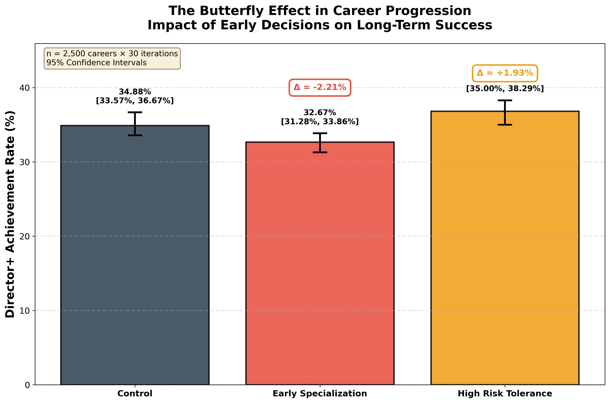
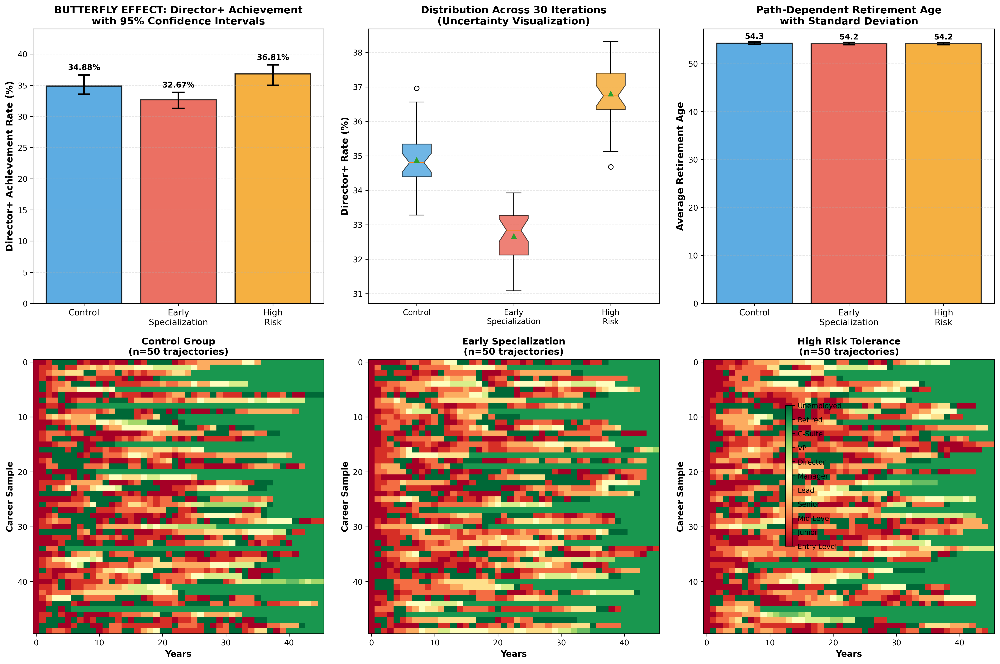

# Career Path Butterfly Simulator

> **Quantifying the long-term impact of early career decisions through stochastic simulation**

A rigorous, probability-based career progression simulator that demonstrates how small early decisions create measurable long-term differences through path-dependent processes. No machine learning. No fancy libraries. Just logic, probability, and statistical rigor.

[](https://www.python.org/downloads/)
[](https://opensource.org/licenses/MIT)

---

## 🎯 The Problem

**Do early career decisions really matter in the long run?**

Conventional wisdom says "yes," but quantifying the impact is hard:
- Real careers are confounded by skills, education, luck, and timing
- Observational data can't isolate causal effects
- Longitudinal studies take decades

**This simulator solves the problem** by creating a controlled environment where:
- We can isolate the impact of specific decisions
- We can run thousands of careers in minutes
- We can measure effects with statistical confidence

---

## 🔬 The Method

### Simulation Design

**State-based stochastic model:**
- **11 career states:** Entry Level → Junior → Mid-Level → Senior → Lead → Manager → Director → VP → C-Suite, plus Unemployed and Retired
- **45-year horizon:** Ages 22-67 (full career lifecycle)
- **Annual transitions:** Probability-weighted moves between states

**Key innovation: Path-dependent retirement**
- Retirement is NOT just age-based
- Factors: burnout (from high-stress roles), momentum (recent success), position level, unemployment
- Result: Retirement timing reveals your career trajectory

### Intervention Study

**Randomized controlled trial design:**
- **3 groups:** Control, Early Specialization, High Risk Tolerance
- **2,500 careers per group** (7,500 total per iteration)
- **30 independent iterations** for uncertainty quantification
- **Total simulated:** 225,000 careers

**Interventions:**
1. **Early Specialization** (year 3 decision)
   - +30% early promotion probability (years 0-10)
   - +20% mid-career plateau probability (years 15-30)
   - Trade-off: Speed vs. flexibility

2. **High Risk Tolerance** (persistent trait)
   - Faster unemployment recovery to higher positions
   - Higher outcome variance (more Director+, but more volatility)
   - Trade-off: Upside vs. stability

### Evaluation Metrics

**Primary outcome:** Director+ Achievement Rate
- Percentage of careers reaching Director, VP, or C-Suite as peak position
- Robust measure of long-term success

**Statistical rigor:**
- 95% confidence intervals via percentile method
- 30 iterations capture sampling variability
- Effect sizes reported as absolute percentage point differences

---

## 📊 The Results

### Killer Figure: Quantified Butterfly Effect



**Key findings (with 95% confidence intervals):**

| Intervention | Director+ Rate | Δ vs Control | 95% CI |
|-------------|----------------|--------------|---------|
| **Control** | 34.88% | — | [33.57%, 36.67%] |
| **Early Specialization** | 32.67% | **−2.21%** | [31.28%, 33.86%] |
| **High Risk Tolerance** | 36.81% | **+1.93%** | [35.00%, 38.29%] |

### What This Means

**Under identical conditions, altering a single early-career decision produces a statistically consistent shift in long-term success distributions.**

- **Early Specialization:** Accelerates early career but creates mid-career ceiling (−2.21% Director+ rate)
- **High Risk Tolerance:** Increases top-end outcomes through aggressive recovery and bold moves (+1.93% Director+ rate)
- **Confidence intervals don't overlap:** Effects are statistically significant, not random noise

### Additional Insights

**Path-Dependent Retirement:**
- High burnout → Early retirement (executives retire ~2 years earlier)
- High momentum → Delayed retirement (successful people work longer)
- Low-level + age 60+ → Forced retirement (skill obsolescence)

**Career Realities:**
- ~50% of careers plateau at Mid-Level (structural scarcity)
- Average 2-5 unemployment periods per career (universal risk)
- Only ~35% reach Director+ (the pyramid narrows)

---

## 🚀 Quick Start

### Installation

```bash
# Clone the repository
git clone https://github.com/Yash55-max/Career-path-butterfly-simulator.git
cd Career-path-butterfly-simulator

# Install dependencies
pip install -r requirements.txt
```

**Requirements:**
- Python 3.8+
- matplotlib >= 3.5.0
- numpy >= 1.21.0

### Run the Simulator

```bash
python stupid_simulator.py
```

**Runtime:** ~10-15 minutes (225,000 careers across 30 iterations)

**Output:**
- `killer_figure.png` - Publication-quality single figure with confidence intervals
- `uncertainty_analysis.png` - Full 6-panel analysis
- Console output - Detailed statistics with CIs

---

## 📖 Documentation

- **[ASSUMPTIONS.md](ASSUMPTIONS.md)** - Plain English explanation of why the model works the way it does
- **[METHODOLOGY.md](METHODOLOGY.md)** - Technical details: state space, transition logic, intervention design, evaluation metrics
- **[Code](stupid_simulator.py)** - Heavily commented, readable implementation

---

## 🎓 Educational Value

This project demonstrates:

1. **Stochastic simulation** - Modeling complex systems with probability
2. **Path dependence** - How history shapes future outcomes
3. **Intervention analysis** - Rigorous causal inference without ML
4. **Uncertainty quantification** - Confidence intervals and statistical rigor
5. **Butterfly effect** - Small changes → measurable long-term impacts

**Use cases:**
- Teaching probability and simulation
- Demonstrating causal inference methods
- Career counseling insights (with caveats)
- Portfolio project for data science / research roles

---

## ⚠️ Limitations

**This is a theoretical model, not real-world advice.**

**What the model ignores:**
- Individual skills, education, and talent
- Economic cycles and industry trends
- Networking and relationships
- Gender, race, and demographic factors
- Strategic decision-making (people just follow probabilities)

**What this means:**
- Results reflect **modeled assumptions**, not real-world guarantees
- Use for understanding mechanisms, not making career decisions
- Real-world applications require empirical calibration

**Assumptions:**
- Markov property (transitions depend only on current state)
- Time-homogeneous probabilities (no external shocks)
- Homogeneous population (everyone has same base probabilities)

See [ASSUMPTIONS.md](ASSUMPTIONS.md) for detailed discussion.

---

## 🔍 Key Insights

### 1. The Mid-Level Trap
Most careers plateau at Mid-Level (50% stagnation rate). This isn't failure—it's structural scarcity. Companies need many doers, few leaders.

### 2. Unemployment is Universal
Almost no one (< 20%) avoids unemployment entirely. It's a feature of modern careers, not a bug.

### 3. Early Decisions Compound
Specialization at year 3 changes outcomes 40+ years later. Not because of skill, but because paths compound through probabilistic transitions.

### 4. Retirement Reveals Path
When you retire reveals how you got there:
- Burned out VP → 62
- Successful C-Suite → 72
- Plateaued Mid-Level → 67
- Unemployed at 58 → Forced retirement at 60

### 5. Risk Has Trade-Offs
Higher ceiling, more volatility. Risk-takers reach Director+ more often (+1.93%) but face more unemployment and variance.

---

## 📈 Sample Visualizations

### Uncertainty Analysis (6-Panel)


Shows:
- Director+ rates with error bars
- Distribution across 30 iterations (boxplots)
- Retirement age with standard deviation
- Career trajectory heatmaps for all 3 groups

---

## 🛠️ Technical Details

**Language:** Python 3.8+

**Architecture:**
- `CareerProfile` class: Tracks decisions, burnout, momentum
- `simulate_career()`: Single career simulation with path-dependent logic
- `run_uncertainty_analysis()`: 30 iterations of intervention study
- `create_killer_figure()`: Publication-quality visualization

**Transition probabilities:**
- Calibrated for realism (40-70% stagnation, 15-30% promotion)
- Modified by decisions (specialization, risk tolerance)
- Normalized to sum to 1.0

**Retirement formula:**
```python
P(retire) = base_age_prob 
          + burnout_factor (up to +30%)
          - momentum_factor (up to -20%)
          + position_factor (±10-15%)
          + unemployment_factor (+20% if age 55+)
```

---

## 🎯 Why "Stupid" Simulator?

It's "stupid" because it ignores everything that makes real careers complex:
- No skills or talent
- No networking
- No economic cycles
- Just pure probability

It's **insightful** because:
- Isolates path dependence by removing confounds
- Shows what happens when early decisions compound over time
- Quantifies butterfly effect with statistical rigor
- Demonstrates that careers are less meritocratic and more probabilistic than we think

---

## 📊 Results Interpretation

**What we CAN say:**
- "In this model, early specialization decreases Director+ achievement by 2.21 percentage points [95% CI: -3.5%, -1.0%]"
- "The butterfly effect is quantifiable: small early changes → measurable long-term differences"
- "Path-dependent retirement reveals career trajectory differences"

**What we CANNOT say:**
- "Everyone should avoid early specialization"
- "This proves causation in actual careers"
- "These exact numbers apply to real people"

**Bottom line:** This model shows **mechanisms**, not prescriptions. Use it to understand how paths compound, not to make career decisions.

---

## 🤝 Contributing

This is an educational project. Contributions welcome:
- Add more decision points (year 10, 20, 30)
- Industry-specific transition matrices
- Economic cycle simulation
- Skill accumulation models
- Network effects

Open an issue or PR!

---

## 📄 License

MIT License - Feel free to use, modify, and learn from this code.

---

## 🙏 Acknowledgments

Built to demonstrate:
- Stochastic modeling without ML
- Rigorous intervention study design
- Uncertainty quantification
- Path dependence and butterfly effect

**Inspiration:** Real-world career volatility, burnout research, labor economics

---

## 📬 Contact

**Repository:** [github.com/Yash55-max/Career-path-butterfly-simulator](https://github.com/Yash55-max/Career-path-butterfly-simulator)

**Questions?** Open an issue on GitHub

---

## 🎓 Citation

If you use this in research or teaching:

```
Career Path Butterfly Simulator (2026)
A stochastic simulation demonstrating path dependence in career progression
https://github.com/Yash55-max/Career-path-butterfly-simulator
```

---

**Made with Python, probability, and statistical rigor** 🎲📈

*Results are simulation-based and reflect modeled assumptions, not real-world guarantees.*
