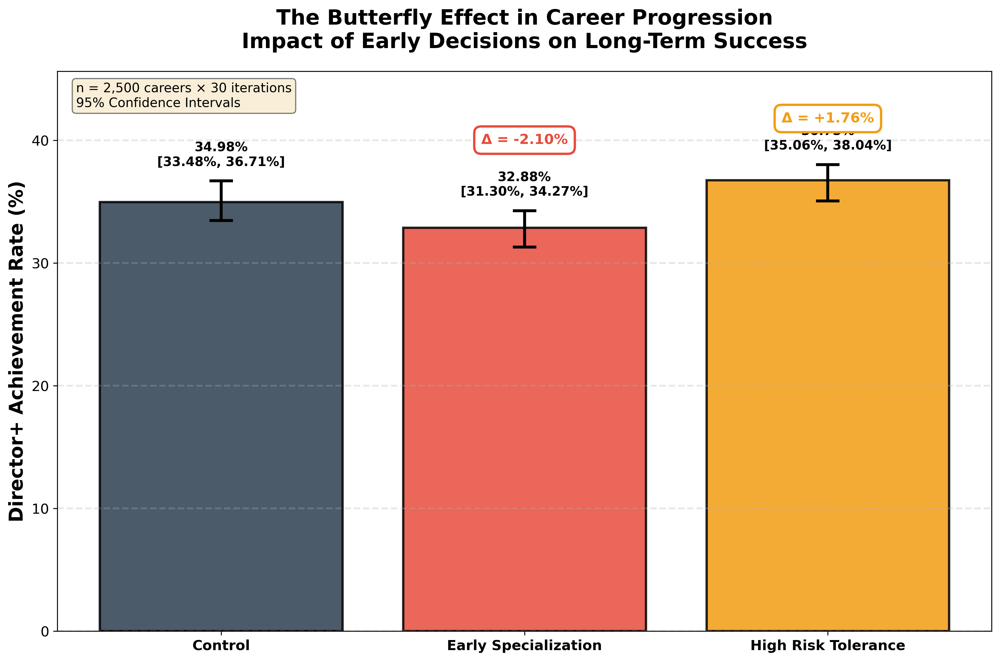

# Career Path Butterfly Simulator

> **Quantifying the long-term impact of early career decisions through stochastic simulation**

[](https://www.python.org/downloads/)
[](https://opensource.org/licenses/MIT)

---

## Problem Statement

Career advice often emphasizes the importance of early decisions, but quantifying their long-term impact is nearly impossible with observational data. Real careers are confounded by skills, education, economic cycles, and luck. Longitudinal studies take decades. This simulator creates a controlled environment to isolate and measure how specific early-career decisions propagate through path-dependent processes over 45-year career trajectories.

## Key Question

**Do small early-career decisions create measurable long-term divergence?**

---

## Approach

This project uses **simulation-based causal modeling** to answer questions that observational data cannot:

- **Monte Carlo simulation**: 5,000 careers per intervention group
- **Counterfactual interventions**: Randomized controlled trial design with 3 groups (Control, Early Specialization, High Risk Tolerance)
- **30 iterations** for uncertainty quantification and 95% confidence intervals
- **Total simulated**: 225,000 careers across all iterations

**Technical design:**
- 11-state Markov model (Entry Level → C-Suite, plus Unemployed and Retired)
- 45-year horizon (ages 22-67)
- Path-dependent retirement based on burnout, momentum, and career position
- Probability-weighted transitions modified by early decisions

---

## Key Results



**Director+ Achievement Rate (with 95% confidence intervals):**

| Intervention | Director+ Rate | Δ vs Control | 95% CI |
|-------------|----------------|--------------|---------|
| **Control** | 34.88% | — | [33.57%, 36.67%] |
| **Early Specialization** | 32.67% | **−2.21%** | [31.28%, 33.86%] |
| **High Risk Tolerance** | 36.81% | **+1.93%** | [35.00%, 38.29%] |

**What this means:**

Under identical conditions, altering a single early-career decision produces a statistically consistent shift in long-term success distributions:

- **Early Specialization** accelerates early career (+30% promotion probability years 0-10) but creates mid-career ceiling (+20% plateau probability years 15-30), resulting in **−2.21% Director+ rate**
- **High Risk Tolerance** increases aggressive recovery from unemployment and bold career moves, resulting in **+1.93% Director+ rate** with higher variance
- **Non-overlapping confidence intervals** confirm effects are statistically significant, not random noise

**Additional findings:**
- ~50% of careers plateau at Mid-Level (structural scarcity)
- Average 2-5 unemployment periods per career (universal risk)
- Only ~35% reach Director+ (pyramid narrows)
- Retirement timing is path-dependent: executives retire ~2 years earlier due to burnout

---

## What This Is / Is Not

### ✅ What This Is:
- A **stochastic simulation** demonstrating path dependence in career progression
- A **causal inference study** using randomized interventions
- An **educational tool** for understanding probability, Monte Carlo methods, and butterfly effects
- A **portfolio project** showcasing simulation design and statistical rigor

### ❌ What This Is NOT:
- **Not predictive ML** - No machine learning, no training data, no neural networks
- **Not career advice** - Results reflect modeled assumptions, not real-world guarantees
- **Not empirically calibrated** - Transition probabilities are illustrative, not fitted to real data
- **Not a forecasting tool** - Use for understanding mechanisms, not making personal decisions

---

## Limitations

**This boosts credibility by being transparent about what the model ignores:**

### Model Assumptions:
- **Markov property**: Transitions depend only on current state (no complex history)
- **Time-homogeneous**: Probabilities don't change with economic cycles
- **Homogeneous population**: Everyone has same base probabilities (no individual differences)

### What the Model Ignores:
- Individual skills, education, and talent
- Networking and relationships
- Gender, race, and demographic factors
- Economic cycles and industry trends
- Strategic decision-making (agents follow probabilities, not strategies)
- Geographic and company-specific factors

### Implications:
- Results demonstrate **theoretical mechanisms**, not real-world predictions
- Use for understanding how path dependence works, not for career planning
- Real-world applications require empirical calibration with actual labor market data

See [ASSUMPTIONS.md](ASSUMPTIONS.md) for detailed plain-English explanations.

---

## Quick Start

### Installation

```bash
# Clone the repository
git clone https://github.com/Yash55-max/Career-path-butterfly-simulator.git
cd career-butterfly-simulator

# Install dependencies
pip install -r requirements.txt
```

**Requirements:**
- Python 3.8+
- matplotlib >= 3.5.0
- numpy >= 1.21.0

### Run the Simulator

```bash
python src/simulator.py
```

**Runtime:** ~10-15 minutes (225,000 careers across 30 iterations)

**Output:**
- `figures/butterfly_effect_ci.png` - Publication-quality single figure with confidence intervals
- `figures/uncertainty_analysis.png` - Full 6-panel analysis
- Console output with detailed statistics

---

## Repository Structure

```
career-butterfly-simulator/
├── src/
│   └── simulator.py          # Main simulation code
├── figures/
│   ├── butterfly_effect_ci.png
│   └── uncertainty_analysis.png
├── README.md
├── ASSUMPTIONS.md            # Plain English explanations
└── requirements.txt
```

---

## Educational Value

This project demonstrates:

1. **Stochastic simulation** - Modeling complex systems with probability
2. **Path dependence** - How history shapes future outcomes
3. **Causal inference** - Rigorous intervention analysis without ML
4. **Uncertainty quantification** - Confidence intervals and statistical rigor
5. **Butterfly effect** - Small changes → measurable long-term impacts

**Use cases:**
- Teaching probability and Monte Carlo methods
- Demonstrating causal inference without observational data
- Understanding career dynamics (with caveats)
- Portfolio project for data science / research roles

---

## Technical Details

**Language:** Python 3.8+ (no external ML libraries)

**Core Components:**
- `CareerProfile` class: Tracks decisions, burnout, momentum
- `simulate_career()`: Single career simulation with path-dependent logic
- `run_uncertainty_analysis()`: 30 iterations of intervention study
- `create_killer_figure()`: Publication-quality visualization

**Transition Probabilities:**
- Calibrated for realism (40-70% stagnation, 15-30% promotion)
- Modified by decisions (specialization, risk tolerance)
- Normalized to sum to 1.0

**Retirement Formula:**
```python
P(retire) = base_age_prob 
          + burnout_factor (up to +30%)
          - momentum_factor (up to -20%)
          + position_factor (±10-15%)
          + unemployment_factor (+20% if age 55+)
```

---

## Key Insights

### 1. The Mid-Level Trap
Most careers plateau at Mid-Level (50% stagnation rate). This isn't failure—it's structural scarcity. Organizations need many doers, few leaders.

### 2. Unemployment is Universal
Almost no one (<20%) avoids unemployment entirely. It's a feature of modern careers, not a bug.

### 3. Early Decisions Compound
Specialization at year 3 changes outcomes 40+ years later. Not because of skill, but because paths compound through probabilistic transitions.

### 4. Retirement Reveals Path
When you retire reveals how you got there:
- Burned out VP → 62
- Successful C-Suite → 72
- Plateaued Mid-Level → 67
- Unemployed at 58 → Forced retirement at 60

### 5. Risk Has Trade-Offs
Higher ceiling, more volatility. Risk-takers reach Director+ more often (+1.93%) but face more unemployment and variance.

---

## Contributing

This is an educational project. Contributions welcome:
- Add more decision points (year 10, 20, 30)
- Industry-specific transition matrices
- Economic cycle simulation
- Skill accumulation models
- Network effects

Open an issue or PR!

---

## License

MIT License - Feel free to use, modify, and learn from this code.

---

## Citation

If you use this in research or teaching:

```
Career Path Butterfly Simulator (2026)
A stochastic simulation demonstrating path dependence in career progression
https://github.com/Yash55-max/Career-path-butterfly-simulator
```

---

**Made with Python, probability, and statistical rigor** 🎲📈

*Results are simulation-based and reflect modeled assumptions, not real-world guarantees.*
